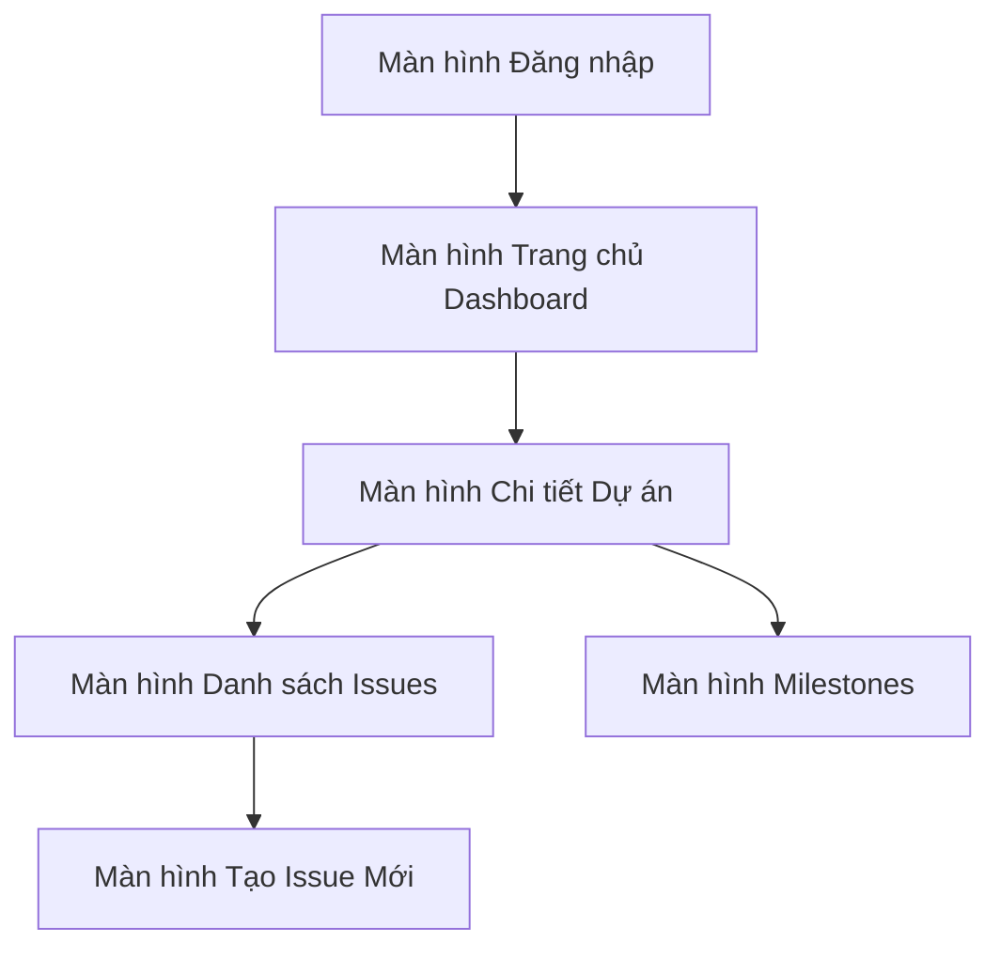

# TÀI LIỆU ĐẶC TẢ YÊU CẦU
***Hệ thống Web Quản lý Dự án Công ty X***

## Mục lục
***
- [[#Revision History|Revision History]]
- [[#1. Giới thiệu tổng quan về tài liệu|1. Giới thiệu tổng quan về tài liệu]]
	- [[#1. Giới thiệu tổng quan về tài liệu#1.1 Mục đích của tài liệu|1.1 Mục đích của tài liệu]]
	- [[#1. Giới thiệu tổng quan về tài liệu#1.2 Phạm vi của tài liệu|1.2 Phạm vi của tài liệu]]
	- [[#1. Giới thiệu tổng quan về tài liệu#1.3 Các định nghĩa và các từ viết tắt|1.3 Các định nghĩa và các từ viết tắt]]
	- [[#1. Giới thiệu tổng quan về tài liệu#1.4 Tham khảo|1.4 Tham khảo]]
- [[#2. Tổng quan hệ thống và đặc tả chức năng|2. Tổng quan hệ thống và đặc tả chức năng]]
	- [[#2. Tổng quan hệ thống và đặc tả chức năng#2.1 Quan điểm về sản phẩm|2.1 Quan điểm về sản phẩm]]
	- [[#2. Tổng quan hệ thống và đặc tả chức năng#2.2 Yêu cầu người dùng|2.2 Yêu cầu người dùng]]
	- [[#2. Tổng quan hệ thống và đặc tả chức năng#2.3 Đặc tả người dùng|2.3 Đặc tả người dùng]]
	- [[#2. Tổng quan hệ thống và đặc tả chức năng#2.4 Đặc tả yêu cầu chức năng|2.4 Đặc tả yêu cầu chức năng]]
- [[#3. Mô hình hóa hệ thống|3. Mô hình hóa hệ thống]]
	- [[#3. Mô hình hóa hệ thống#3.1 Vai trò (phân quyền người dùng)|3.1 Vai trò (phân quyền người dùng)]]
	- [[#3. Mô hình hóa hệ thống#3.2 Sơ đồ use case tổng quát của hệ thống|3.2 Sơ đồ use case tổng quát của hệ thống]]
	- [[#3. Mô hình hóa hệ thống#3.3 Đặc tả use case:|3.3 Đặc tả use case:]]
	- [[#3. Mô hình hóa hệ thống#3.4 Luồng màn hình (Screen flow)|3.4 Luồng màn hình (Screen flow)]]
	- [[#3. Mô hình hóa hệ thống#3.5 Mô tả màn hình|3.5 Mô tả màn hình]]
	- [[#3. Mô hình hóa hệ thống#3.6 Hệ thống cấp quyền|3.6 Hệ thống cấp quyền]]
	- [[#3. Mô hình hóa hệ thống#3.7 Yêu cầu phi chức năng|3.7 Yêu cầu phi chức năng]]
		- [[#3.7 Yêu cầu phi chức năng#3.7.1 Tính bảo mật|3.7.1 Tính bảo mật]]
		- [[#3.7 Yêu cầu phi chức năng#3.7.2 Tính sẵn sàng và khả năng đáp ứng|3.7.2 Tính sẵn sàng và khả năng đáp ứng]]
		- [[#3.7 Yêu cầu phi chức năng#3.7.3 Giao diện|3.7.3 Giao diện]]
		- [[#3.7 Yêu cầu phi chức năng#3.7.4 Khả năng sử dụng|3.7.4 Khả năng sử dụng]]

## Revision History
| **Date**  | **Version** | **Description**       | **Author**      |
| :-------- | :---------- | :-------------------- | :-------------- |
| 14/6/2024 | 1.0         | Khởi tạo tài liệu SRS | Phạm Thiên Minh |


---

## 1. Giới thiệu tổng quan về tài liệu
### 1.1 Mục đích của tài liệu
Mục đích của tài liệu là cung cấp mô tả chi tiết về các yêu cầu đối với Hệ thống Web quản lý dự án cho Công ty X. Tài liệu này xác định các tính năng, giao diện, và cách hệ thống phản hồi các tương tác của người dùng. Hệ thống giúp quản lý các kế hoạch thực hiện (milestones), bản chuyển giao (releases) và các vấn đề (issues) nhằm tối ưu hóa tiến độ làm việc.

### 1.2 Phạm vi của tài liệu
Hệ thống được thiết kế để triển khai ở cấp độ phòng ban và trung tâm của Công ty X. Phần mềm cung cấp các công cụ tự động hóa quy trình quản lý dự án thay vì làm thủ công, hỗ trợ giao tiếp và phân quyền chặt chẽ giữa các thành viên thuộc bộ phận và ngoài bộ phận.

### 1.3 Các định nghĩa và các từ viết tắt
| **Thuật ngữ / Viết tắt** | **Định nghĩa** |
| :--- | :--- |
| SRS | Software Requirements Specification (Tài liệu đặc tả yêu cầu phần mềm) |
| Issue | Một vấn đề, nhiệm vụ hoặc lỗi cần giải quyết trong dự án |
| Milestone | Cột mốc kế hoạch quan trọng của dự án |
| Release | Bản chuyển giao/phát hành sản phẩm |
| Assignee | Người được giao chịu trách nhiệm chính cho một Issue |

### 1.4 Tham khảo
*   Tài liệu Template1-SRS.docx.
*   Nền tảng quản lý dự án GitLab (https://gitlab.com).

---

## 2. Tổng quan hệ thống và đặc tả chức năng
### 2.1 Quan điểm về sản phẩm
Hệ thống Web Quản lý Dự án là một sản phẩm phần mềm độc lập, hoạt động tương tự cấu trúc của GitLab nhưng được tùy biến cho cấu trúc phòng ban của Công ty X. Hệ thống giao tiếp trực tiếp với cơ sở dữ liệu nội bộ và người dùng thông qua trình duyệt web.

**Sơ đồ ngữ cảnh của hệ thống:**
```mermaid
graph TD
    A[Thành viên trực thuộc bộ phận] -->|Truy cập toàn quyền dự án| S((Hệ thống Web Quản lý Dự án))
    B[Nhân sự ngoài bộ phận] -->|Truy cập theo phân quyền| S
    C[Quản lý cấp cao] -->|Xem báo cáo, cấp quyền| S
    S -->|Cập nhật trạng thái Issues, Milestones| A
    S -->|Thông báo nhiệm vụ| B
````

### 2.2 Yêu cầu người dùng
Người dùng cần một giao diện trực quan để khởi tạo dự án mới, phân công nhân sự, và theo dõi tiến độ. Nhân sự phòng ban cần xem được toàn bộ issue của bộ phận mình, trong khi nhân sự làm việc chéo (cross-functional) cần truy cập được vào các dự án cụ thể mà họ được mời.
### 2.3 Đặc tả người dùng
- **Thành viên phòng ban (Member):** Có kiến thức cơ bản về quy trình dự án. Có quyền mặc định xem và tương tác với các issues, milestones thuộc bộ phận của mình.
- **Nhân sự ngoài bộ phận (Guest/Assignee):** Có quyền hạn chế, chỉ được phép xem hoặc chỉnh sửa các issues trên dự án mà họ được cấp quyền rõ ràng.
- **Trưởng bộ phận (Manager):** Có quyền tạo dự án, quản lý danh sách thành viên (Members) và phân quyền cho người ngoài bộ phận.
### 2.4 Đặc tả yêu cầu chức năng

Hệ thống cung cấp các chức năng chính:
- **Quản lý thông tin dự án:** Tạo dự án, thêm sửa xóa thành viên.
- **Quản lý Milestones:** Lập kế hoạch các cột mốc thời gian.
- **Quản lý Releases:** Đóng gói và phát hành các phiên bản dự án.
- **Quản lý Issues:** Tạo, gán người thực hiện, bình luận và đóng các vấn đề.

---

## 3. Mô hình hóa hệ thống

### 3.1 Vai trò (phân quyền người dùng)

- **Manager (Trưởng dự án):** Quản lý toàn bộ vòng đời dự án và phân quyền người dùng.
- **Internal Member:** Thao tác trên tất cả module (Issues, Milestones) của bộ phận.
- **External Member:** Chỉ thao tác trên các Issues/Milestones được chỉ định.

### 3.2 Sơ đồ use case tổng quát của hệ thống

```mermaid
flowchart LR
    M((Manager))
    I((Internal Member))
    E((External Member))

    UC1([Quản lý thông tin dự án])
    UC2([Quản lý Milestones])
    UC3([Quản lý Releases])
    UC4([Quản lý Issues])

    M --> UC1
    M --> UC2
    M --> UC3
    M --> UC4

    I --> UC2
    I --> UC3
    I --> UC4

    E -.->|Quyền hạn chế| UC4
    E -.->|Quyền hạn chế| UC2
```

### 3.3 Đặc tả use case:

**Đặc tả chi tiết Use Case "Quản lý Issues" (Tạo mới Issue)**

|**Use Case Name**|**Create Issue (Tạo mới Issue)**|
|:--|:--|
|**Điều kiện**|Người dùng đã đăng nhập và có quyền truy cập vào dự án (là Internal Member hoặc External Member được cấp quyền).|
|**Luồng chính**|1. Người dùng chọn dự án từ trang chủ.2. Chọn menu "Issues" ở thanh điều hướng bên trái.3. Hệ thống hiển thị lưới danh sách các Issues.4. Người dùng bấm chọn nút "New Issue".5. Người dùng nhập Tiêu đề, Mô tả, gán Assignee và chọn Milestone.6. Người dùng bấm "Submit issue".7. Hệ thống lưu vào CSDL và điều hướng tới trang chi tiết của Issue vừa tạo.|
|**Luồng phụ**|Ở bước 2, nếu người dùng là External Member không được cấp quyền xem Issue, hệ thống ẩn menu "Issues" hoặc thông báo "Access Denied".Ở bước 5, nếu bỏ trống phần Tiêu đề, hệ thống báo lỗi yêu cầu nhập trường bắt buộc.|

### 3.4 Luồng màn hình (Screen flow)


### 3.5 Mô tả màn hình

| **#** | **Màn hình**            | **Mô tả**                                                                  |
| :---- | :---------------------- | :------------------------------------------------------------------------- |
| 1     | Màn hình Trang chủ      | Hiển thị danh sách các dự án người dùng đang tham gia                      |
| 2     | Màn hình Chi tiết Dự án | Hiển thị tổng quan dự án, thanh menu chứa Issues, Milestones, Releases     |
| 3     | Màn hình Tạo Issue Mới  | Form điền thông tin (Tiêu đề, mô tả, tệp đính kèm, người chịu trách nhiệm) |

### 3.6 Hệ thống cấp quyền

| **Hoạt động / Màn hình**         | **Manager** | **Internal Member** | **External Member** |
| :------------------------------- | :---------- | :------------------ | :------------------ |
| Truy vấn Tất cả Dữ liệu          | X           | X                   |                     |
| Truy vấn Dữ liệu Được phân quyền | X           | X                   | X                   |
| Thêm Dự án Mới                   | X           |                     |                     |
| Thêm/Cập nhật Issues             | X           | X                   | X                   |
| Xóa Dự án/Milestones             | X           |                     |                     |

### 3.7 Yêu cầu phi chức năng

#### 3.7.1 Tính bảo mật

Hệ thống phải giới hạn quyền truy cập chặt chẽ. Nhân sự phòng ban A không thể xem thông tin của phòng ban B trừ khi Manager của phòng ban B cấp quyền rõ ràng vào từng dự án cụ thể. Mật khẩu người dùng phải được mã hóa.

#### 3.7.2 Tính sẵn sàng và khả năng đáp ứng

Hệ thống Web phải duy trì thời gian hoạt động (uptime) đạt 99.9% (sẵn sàng 24/7) để đáp ứng nhu cầu cập nhật tiến độ liên tục của nhiều trung tâm và phòng ban ở các thời điểm khác nhau.

#### 3.7.3 Giao diện

Giao diện phải tuân theo phong cách thiết kế tối giản, cấu trúc thanh menu điều hướng nằm bên tay trái để mang lại trải nghiệm quen thuộc tương tự như GitLab.

#### 3.7.4 Khả năng sử dụng

Hệ thống cần cung cấp các hộp thoại xác nhận khi thực hiện các hành động nguy hiểm (như Xóa dự án, Xóa issue) để tránh lỗi thao tác. Cung cấp tính năng tìm kiếm (Filter) thông minh để người dùng tra cứu issues nhanh chóng.
