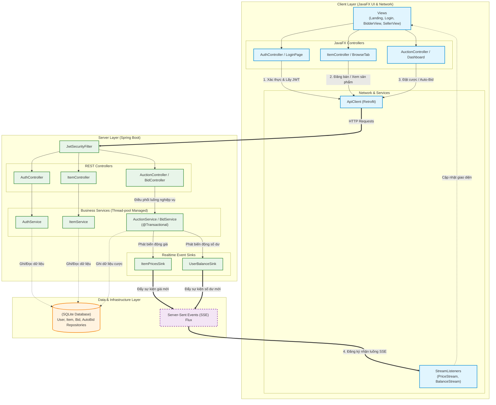

# BÁO CÁO BÀI TẬP LỚN MÔN LẬP TRÌNH NÂNG CAO
**Tên đề tài:** Hệ thống Đấu giá Trực tuyến (Online Auction System)
**Nhóm**: 1
**Thành viên nhóm:** 1. Nguyễn Duy Anh
2. Nguyễn Anh Quân
3. Phạm Thiên Minh
4. Đinh Xuân Thông

---

## 1. Giới thiệu mục tiêu và phạm vi thực hiện

**Mục tiêu:** Xây dựng một nền tảng đấu giá trực tuyến hoạt động theo mô hình Client-Server. Hệ thống cho phép người dùng đóng vai trò là cả người bán (Seller) và người mua (Bidder), đảm bảo tính minh bạch, nhanh chóng và an toàn trong các giao dịch đấu giá. 

**Phạm vi thực hiện:**
* **Quản lý người dùng:** Đăng ký, đăng nhập (bảo mật qua JWT), nạp tiền vào tài khoản.
* **Quản lý phiên đấu giá:** Tạo phiên đấu giá mới, cài đặt thời gian và giá khởi điểm.
* **Chức năng đấu giá:** Cho phép người dùng đặt giá thủ công (Manual Bid) hoặc thiết lập tự động đặt giá (Auto-Bid).
* **Cập nhật thời gian thực:** Đồng bộ hóa giá đấu hiện tại và số dư tài khoản của người dùng ngay lập tức (Real-time update) mà không cần tải lại trang.
* **Quản trị viên (Admin):** Quản lý, theo dõi danh sách người dùng và thực hiện cấm (Ban) hoặc gỡ cấm (Unban) các tài khoản vi phạm.

---

## 2. Kiến trúc tổng thể của hệ thống

Hệ thống được thiết kế theo mô hình **Client-Server**, giao tiếp thông qua RESTful API và Server-Sent Events (SSE) để truyền dữ liệu thời gian thực.

*(Nhóm có thể vẽ một sơ đồ khối bằng Draw.io hoặc PlantUML và chèn hình ảnh vào đây: ``)*

**Mô tả kiến trúc:**
* **Backend (Spring Boot):** Xây dựng theo kiến trúc đa tầng (Controller - Service - Repository). 
    * **Tầng Security & Auth:** Quản lý truy cập bằng `JwtSecurityFilter`, cấp phát Access Token và Refresh Token qua `AuthService`.
    * **Tầng Business Logic:** Xử lý nghiệp vụ lõi như đấu giá (`BidService`, `AuctionService`), quản lý sản phẩm (`ItemService`), và quản lý người dùng (`UserService`).
    * **Tầng Real-time (Sinks):** Sử dụng cơ chế Pub/Sub nội bộ (`ItemPricesSink`, `UserBalanceSink`) để đẩy dữ liệu thời gian thực (SSE) xuống Client khi có sự thay đổi về giá hoặc số dư.
* **Frontend (JavaFX):** Ứng dụng mô hình MVC (Model-View-Controller).
    * **Giao diện (View & Controller):** Tách biệt các màn hình (Login, Dashboard, BidderView, SellerView, Admin) bằng file FXML và Controller tương ứng.
    * **Tầng Network:** Quản lý giao tiếp HTTP qua `ApiClient` và `AuthInterceptor` (tự động đính kèm Token). Luồng thời gian thực được lắng nghe và xử lý bởi `PriceStreamListener` và `BalanceStreamListener`.

---

## 3. Các chức năng đạt được và Hướng giải quyết

### 3.1. Xác thực và Phân quyền (Authentication & Authorization)
* **Chức năng:** Đăng nhập, đăng ký, duy trì phiên đăng nhập an toàn và phân quyền Admin/User.
* **Hướng giải quyết:** Sử dụng JSON Web Token (JWT) kết hợp cơ chế Access Token (ngắn hạn) và Refresh Token (dài hạn). Tại Frontend, sử dụng `AuthInterceptor` chặn các request để đính kèm token.
* **Lý do lựa chọn:** JWT giúp hệ thống hoạt động phi trạng thái (stateless), giảm tải cho bộ nhớ Server. Cơ chế Refresh Token giúp nâng cao bảo mật, tự động cấp lại phiên làm việc mà không bắt người dùng đăng nhập liên tục.

### 3.2. Cập nhật thời gian thực (Real-time Update)
* **Chức năng:** Hiển thị ngay lập tức giá đang đấu cao nhất và số dư tài khoản khi có thay đổi.
* **Hướng giải quyết:** Triển khai **Server-Sent Events (SSE)**. Backend tạo các Sink (`ItemPricesSink`, `UserBalanceSink`) để phát sự kiện một chiều xuống Frontend. Frontend dùng các lớp Listener (`PriceStreamListener`, `BalanceStreamListener`) để bắt luồng dữ liệu và cập nhật UI thông qua `Platform.runLater()`.
* **Lý do lựa chọn:** Giao tiếp một chiều từ Server xuống Client phù hợp với bài toán cập nhật thông báo/giá cả. Nhẹ và tốn ít tài nguyên Server hơn so với WebSocket (giao tiếp hai chiều) hay Long-polling.

### 3.3. Xử lý Đấu giá đồng thời (Concurrent Bidding) và Auto-bid
* **Chức năng:** Nhiều Client đặt giá cùng lúc; hệ thống tự động đặt giá hộ người dùng (Auto-bid) theo giới hạn thiết lập trước.
* **Hướng giải quyết:** Tận dụng cơ chế xử lý đa luồng tự động của Spring Boot (mỗi request HTTP được cấp phát một luồng riêng) kết hợp với annotation `@Transactional` tại tầng Service (`AuctionService`, `BidService`). Quá trình đảm bảo toàn vẹn dữ liệu khi nhiều người cùng đặt giá được giao phó cho cơ chế quản lý giao dịch của Spring Data JPA và Database, không cần thiết lập đồng bộ hóa (manual synchronization) thủ công. Đối với Auto-bid, server tự động kiểm tra và sinh các lượt đặt giá ngay trong luồng giao dịch khi giá sản phẩm thay đổi.
* **Lý do lựa chọn:** Tận dụng tối đa sức mạnh và các tiêu chuẩn của framework Spring Boot. Phương pháp này giúp mã nguồn gọn nhẹ (clean code), dễ bảo trì và tránh được các nguy cơ như thắt nút cổ chai hiệu năng (bottleneck) hay deadlock thường gặp nếu tự implement các cơ chế lock bằng tay.

### 3.4. Quản lý lỗi toàn cục (Global Exception Handling)
* **Chức năng:** Trả về mã lỗi HTTP chuẩn và thông báo thân thiện.
* **Hướng giải quyết:** Sử dụng `@RestControllerAdvice` (`GlobalExceptionHandler`) tại Backend để gom tất cả các Exception (như Token hết hạn, sai định dạng) và trả về `BaseResponse`.
* **Lý do lựa chọn:** Mã nguồn sạch hơn, dễ dàng cho Frontend parse lỗi và hiển thị lên `NotificationPopup` thống nhất.

---

## 4. Phân chia công việc

| Họ và Tên | MSSV | Nhiệm vụ thực hiện | Tỷ lệ hoàn thành |
| :--- | :--- | :--- | :---: |
| [Tên SV 1] | [Mã 1] | **Backend:** Dựng Base, Auth (JWT), User, API Đấu giá. Thiết lập luồng Realtime (SSE Sinks). Viết README. | 100% |
| [Tên SV 2] | [Mã 2] | **Backend:** Xử lý logic Auto-bid, API Admin. **Frontend:** Dựng kiến trúc JavaFX, Network, Login/Register. | 100% |
| [Tên SV 3] | [Mã 3] | **Frontend:** Giao diện Dashboard, Browse, Seller/Bidder View. Tích hợp Real-time Listeners, quay Video Demo. | 100% |

*(Ghi chú: Bảng trên chỉ là dự thảo, nhóm hãy tự điều chỉnh lại nhiệm vụ theo thực tế công việc đã làm)*