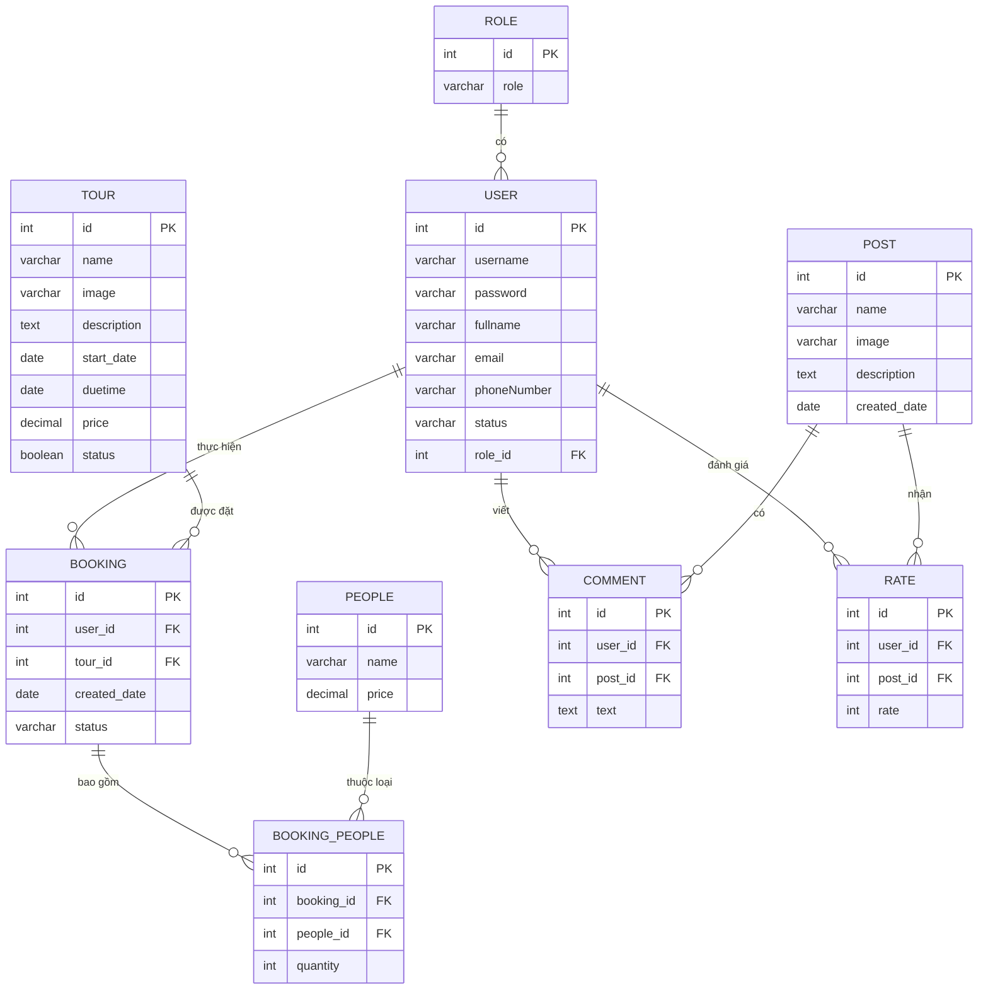

Hướng dẫn Học tập Chi tiết: Assignment 1 - Dự án Đặt vé Du lịch (PRJ321x)

1. Tổng quan Dự án và Mục tiêu Học tập

Chào các bạn, tôi là Senior Technical Mentor của các bạn trong dự án này. Website Đặt vé Du lịch không chỉ đơn thuần là một bài tập kỹ thuật; nó là giải pháp kết nối giữa du khách và các tour du lịch trong kỷ nguyên số. Mục tiêu của chúng ta là xây dựng một nền tảng chuyên nghiệp, nơi du khách có thể tra cứu thông tin chi tiết, đặt vé và tương tác với các dịch vụ du lịch.

- **Thời gian dự kiến hoàn thành:** 480 phút.
- **Kiến thức trọng tâm cần vận dụng:**
    - **Công nghệ Core:** JSP, Servlet, JSTL (JSP Standard Tag Library).
    - **Kiến trúc:** Triển khai theo mô hình MVC (Model-View-Controller).
    - **Quản lý trạng thái:** Sử dụng Session và Cookies để duy trì phiên làm việc.
    - **Database:** Tương tác với cơ sở dữ liệu (CRUD) thông qua JDBC.

2. Tổ chức Dự án và Kiến trúc Hệ thống

Với vai trò là một System Architect, tôi yêu cầu các bạn tuân thủ nghiêm ngặt mô hình MVC. Để hiểu cách hệ thống vận hành, hãy nhìn vào quy trình xử lý của **Dispatcher Servlet** (Dựa trên sơ đồ luồng dữ liệu chuẩn):

1. **Request:** Client gửi yêu cầu.
2. **Dispatcher:** Tiếp nhận và phối hợp với **Handler Mapping** để xác định Controller phù hợp.
3. **Execution:** Controller gọi lớp **Service** (chứa logic nghiệp vụ), Service gọi **Repository** để truy vấn Database.
4. **Response:** Dữ liệu được trả về Controller, sau đó đẩy sang **View Resolver** để hiển thị kết quả lên View (JSP).

|Tên Package|Vai trò và Trách nhiệm trong Hệ thống|
|---|---|
|**controller**|Điều phối Request, nhận dữ liệu từ View và gửi kết quả về View.|
|**service**|Chứa Logic nghiệp vụ (Business Logic). Đây là nơi kiểm tra các quy tắc tính toán/xử lý.|
|**repository**|Thực hiện thao tác trực tiếp với Database (Data Access Object - DAO).|
|**model**|Chứa các thực thể (Entity/POJO) phản ánh cấu trúc bảng trong DB.|
|**view**|Các tệp JSP, HTML, CSS, JS để giao tiếp với người dùng.|
|**config**|Cấu hình kết nối Database và các thông số hệ thống.|

**Mentor's Pro-Tip:** Đừng viết SQL trực tiếp trong Controller. Hãy tách bạch mã nguồn để dễ bảo trì và mở rộng sau này.

3. Thiết kế Cơ sở Dữ liệu (Database Design)

Hệ thống cần tối thiểu 8-9 thực thể để vận hành ổn định. Lưu ý: Tổng số thực thể không được quá 10 để đảm bảo tính tinh gọn.

**Các bảng dữ liệu chủ chốt:**

- **user:** `id`, `username`, `password`, `fullname`, `email`, `phoneNumber`, `status`, `role_id`.
- **role:** `id`, `role` (Admin/User).
- **tour:** `id`, `name`, `image`, `description`, `start_date`, `duetime` (ngày kết thúc), `price`, `status`.
- **booking:** `id`, `user_id`, `tour_id`, `created_date`, `status`.
- **people:** `id`, `name`, `price` (Quản lý đơn giá: Người lớn 400.000 VNĐ, Trẻ em 200.000 VNĐ).
- **booking_people:** `id`, `booking_id`, `people_id`, `quantity`.
- **post:** `id`, `name`, `image`, `description`, `created_date`.
- **comment:** `id`, `user_id`, `post_id`, `text`.
- **rate:** `id`, `user_id`, `post_id`, `rate` (số sao, kiểu int).

4. Chi tiết Yêu cầu Chức năng cho Quản trị viên (Admin)

4.1. Quản lý người dùng

- **CRUD & UI/UX:** Thực hiện đầy đủ Thêm/Sửa/Xóa. **Yêu cầu bắt buộc:** Khi xóa phải có Pop-up xác nhận tên người dùng để tránh thao tác nhầm.
- **Trạng thái Tài khoản:**
    - Chỉ cho phép tài khoản "Hoạt động" truy cập.
    - Logic nút bấm: Nếu là "Đã khóa" thì chỉ hiển thị nút "Mở", và ngược lại.
- **Cơ chế Tìm kiếm linh hoạt:**
    - Hỗ trợ tìm kiếm theo Email (đúng định dạng) hoặc Số điện thoại.
    - **Kỹ thuật Prefix Match:** Hệ thống phải hỗ trợ cả việc nhập đủ số hoặc chỉ cần nhập vài số đầu (ví dụ: gõ "091" để ra danh sách số Vinaphone).

4.2. Quản lý chuyến du lịch

- **Xác thực Logic ngày tháng:** Sử dụng `Date API` (như `java.time.LocalDate`) để kiểm tra:
    - `Ngày bắt đầu` > `Ngày hiện tại`.
    - `Ngày kết thúc` > `Ngày bắt đầu`.
- **Tích hợp Rich Text Editor:** Trường `description` (Mô tả chi tiết) phải sử dụng khung soạn thảo văn bản (như CKEditor hoặc TinyMCE) để Admin có thể định dạng in đậm, in nghiêng hoặc chèn ảnh.
- **Cơ chế Xóa:** Mentor khuyến khích sử dụng "Soft Delete" (Cập nhật `status` sang `FALSE`) để giữ lại lịch sử dữ liệu thay vì dùng lệnh `DELETE` vật lý.

5. Chi tiết Yêu cầu Chức năng cho Người dùng (User)

5.1. Đăng ký và Đăng nhập

1. **Đăng ký:** Kiểm tra Email đúng định dạng và Mật khẩu phức tạp (bao gồm in hoa, in thường, số và ký tự đặc biệt).
2. **Đăng nhập:** Sử dụng Email/Password. Phải hiển thị thông báo lỗi cụ thể (ví dụ: "Sai mật khẩu" hoặc "Email không tồn tại").

5.2. Tìm kiếm và Khám phá Tour

1. **Trang chủ:** Hiển thị danh sách Tour nổi bật hoặc có giá vé cao nhất (Top Tours).
2. **Logic hiển thị:** Hệ thống tuyệt đối không hiển thị các tour đã kết thúc (`Ngày kết thúc` < `Ngày hiện tại`).
3. **Bộ lọc:** Tích hợp ô tìm kiếm theo tên/giá và bộ chọn ngày (`DatePicker`) để lọc tour theo `Ngày bắt đầu`.

5.3. Quy trình Đặt vé (Booking)

1. **Chi tiết Tour:** Hiển thị đầy đủ thông tin mô tả đã định dạng từ Admin.
2. **Đặt vé:** Người dùng nhập số lượng Người lớn và Trẻ em.
    - _Lưu ý:_ Tính toán tổng tiền dựa trên đơn giá mặc định trong bảng `people` (Người lớn: 400k, Trẻ em: 200k).
3. **Lịch sử:** Trong mục "Thông tin người dùng", hiển thị danh sách tour đã đặt gồm: STT, Ảnh, Tên tour, Số lượng, Ngày đặt và Tổng tiền.

4. Yêu cầu Chức năng Nâng cao (Advanced Features)

**Quản lý bài viết (News):** Admin có thể quản lý tin tức để cung cấp thông tin điểm đến. User có thể truy cập để đọc và tìm hiểu thông tin.

**Tương tác Cộng đồng:** Tại mỗi bài viết, User có thể để lại lời nhắn chia sẻ trải nghiệm và bình chọn "số sao" (1-5 sao). Danh sách bình luận phải được sắp xếp theo thời gian mới nhất lên đầu (Descending Order).

7. Tiêu chí Đánh giá và Thang điểm (Assessment Rubric)

|Tiêu chí|Đặc tả yêu cầu|Trọng số|
|---|---|---|
|**Thiết kế [M]**|Giao diện dễ thao tác; DB hợp lý (<= 10 thực thể).|0.5|
|**User: List & Add [M]**|Hiển thị danh sách (phân trang 5-10 mục), thêm mới và thông báo.|0.5|
|**User: Search & Lock [M]**|Tìm kiếm theo Email/SĐT; Khóa/Mở tài khoản thành công.|0.5|
|**User: Update & Delete [M]**|Cập nhật thông tin; Xóa có Pop-up xác nhận.|0.5|
|**Tour: List & Add [M]**|Phân trang danh sách tour; Thêm mới đủ thông tin.|0.5|
|**Tour: Edit & Detail [M]**|Cập nhật và hiển thị chi tiết tour.|0.5|
|**Admin Booking [M]**|Hiển thị danh sách khách hàng đã đặt vé và thông tin chi tiết.|1.0|
|**Auth [M]**|Đăng nhập/Đăng ký đúng chức năng và phân quyền.|1.0|
|**Search & Home [M]**|Hiển thị Top Tours; Tìm kiếm theo tên và ngày bắt đầu.|1.0|
|**User Booking [M]**|Xem chi tiết, đặt vé thành công và xem lịch sử đặt.|1.0|
|**Nâng cao (Optional)**|Quản lý Post (1.0đ); Bình luận/Đánh giá sao (1.0đ); Detail Post (0.5đ).|2.5|
|**Chất lượng Code**|Tuân thủ MVC; Có comment rõ ràng; Đúng coding convention.|0.5|

_(Ghi chú: [M] là tiêu chí Bắt buộc - Mandatory để đạt điều kiện qua môn)._

8. Hướng dẫn Nộp bài và Quy chuẩn Code

- **Quy chuẩn Code:**
    - Sử dụng Servlet API và mô hình MVC.
    - Mã nguồn phải có comment giải thích các luồng xử lý phức tạp.
    - Tuân thủ Java Naming Conventions (camelCase cho biến/phương thức, PascalCase cho Class).
- **Quy cách đóng gói:**
    - Tên thư mục/File nén: **PRJ321x_ASM1_YourAccount** (Ví dụ: `PRJ321x_ASM1_thangnvFX00000@funix.edu.vn`).
    - Định dạng file: **.zip**.
    - Kiểm tra kỹ kết nối Database trước khi nén để Mentor có thể chạy bài ngay lập tức.
