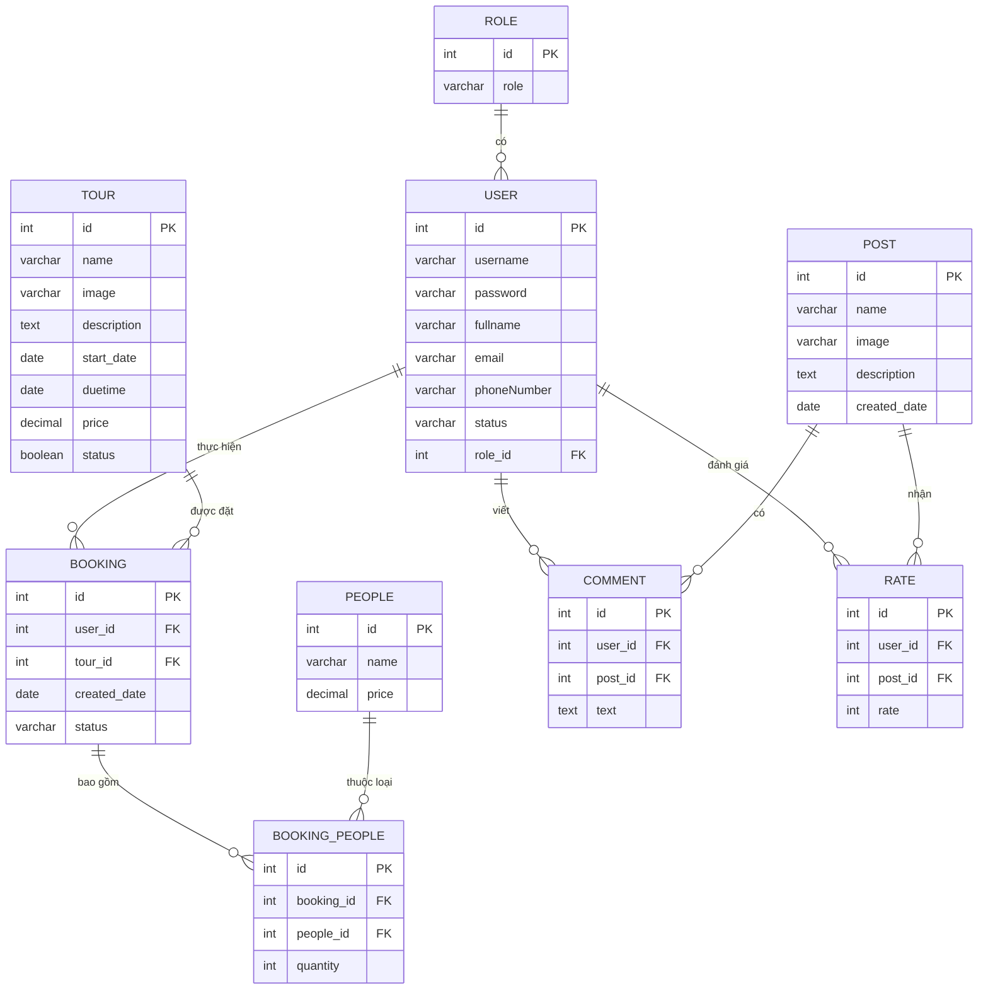

```mermaid
erDiagram
    ROLE ||--o{ USER : "có"
    USER ||--o{ BOOKING : "thực hiện"
    TOUR ||--o{ BOOKING : "được đặt"
    BOOKING ||--o{ BOOKING_PEOPLE : "bao gồm"
    PEOPLE ||--o{ BOOKING_PEOPLE : "thuộc loại"
    USER ||--o{ COMMENT : "viết"
    POST ||--o{ COMMENT : "có"
    USER ||--o{ RATE : "đánh giá"
    POST ||--o{ RATE : "nhận"

    ROLE {
        int id PK
        varchar role
    }
    USER {
        int id PK
        varchar username
        varchar password
        varchar fullname
        varchar email
        varchar phoneNumber
        varchar status
        int role_id FK
    }
    TOUR {
        int id PK
        varchar name
        varchar image
        text description
        date start_date
        date duetime
        decimal price
        boolean status
    }
    BOOKING {
        int id PK
        int user_id FK
        int tour_id FK
        date created_date
        varchar status
    }
    PEOPLE {
        int id PK
        varchar name
        decimal price
    }
    BOOKING_PEOPLE {
        int id PK
        int booking_id FK
        int people_id FK
        int quantity
    }
    POST {
        int id PK
        varchar name
        varchar image
        text description
        date created_date
    }
    COMMENT {
        int id PK
        int user_id FK
        int post_id FK
        text text
    }
    RATE {
        int id PK
        int user_id FK
        int post_id FK
        int rate
    }
```

